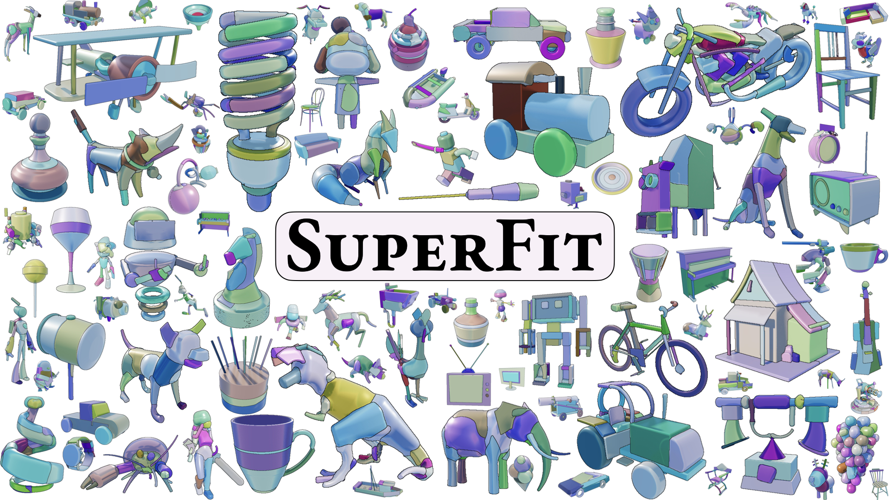
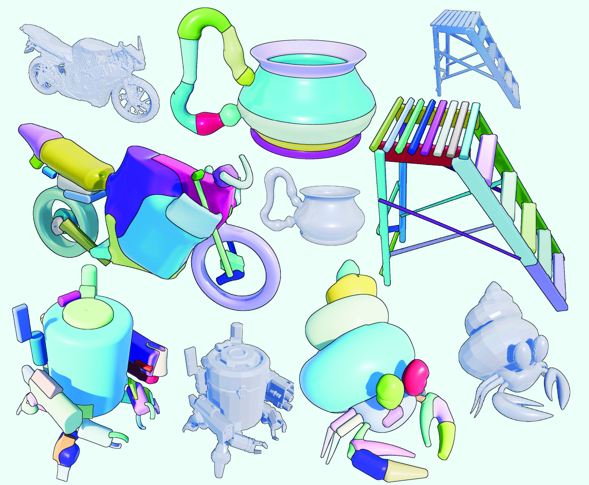
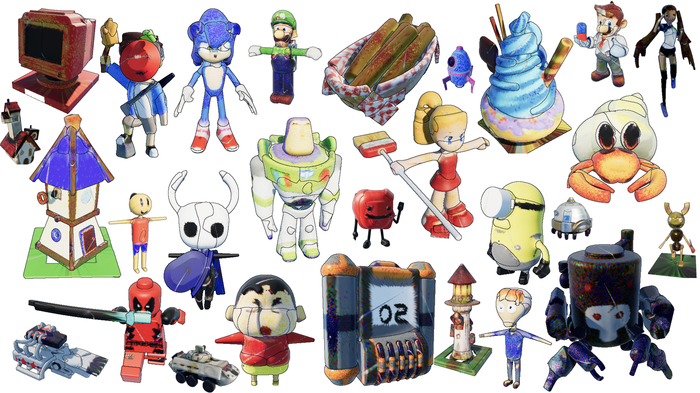

# SuperFit: Residual Primitive Fitting with SuperFrusta

<p align="center">
  
</p>

## What is it?

SuperFit fits compact assemblies of **SuperFrusta** and other primitives to 3D shapes. **[Project page](https://bardofcodes.github.io/superfit)** · **[arXiv](https://arxiv.org/abs/2512.09201)**. Built on top of **[SySL](https://github.com/BardOfCodes/sysl)**. See **[Install](#install-instructions)** below and **[BibTeX](#bibtex)**.

## Install Instructions

Clone and create the conda environment:

```bash
git clone https://github.com/BardOfCodes/superfit.git
cd superfit
conda env create -f env.yml
conda activate superfit
```

### Path Configuration

Before running any scripts, edit `superfit/utils/constants.py` and set the three base paths for your machine:

```python
DATA_BASE = "/path/to/your/data"
PROJECT_BASE = "/path/to/your/projects/project_neo"
OUTPUTS_BASE = "/path/to/your/outputs"
```

All dataset and artifact locations are derived from these. See [notes/dataset.md](notes/dataset.md) for details on expected data layout.

### Additional Dependencies

The following packages will need to be manually installed according to pytorch and cuda version. Please follow the instructions given in the respective repositories:

- [cubvh](https://github.com/ashawkey/cubvh)
- [kaolin](https://github.com/NVIDIAGameWorks/kaolin) (optional, for some notebooks)

## What can you do with it?

### 1. Convert (watertight) meshes into Primitive Assemblies

```bash
python scripts/mesh_to_assembly.py --input_path <path> --save_dir <save-dir> --fastmode --save_html --save_edit_html --save_mesh
```

This will convert an input image into a compact assembly of SuperFrusta. Use different `--ablation` options to generate assemblies of cuboids/superquadrics/supergeons etc. Note that `--fastmode` saves torch compile artifacts at `AOT_ARTIFACT_DIR` as specified in `superfit/utils/constants.py`.

<p align="center">
  
</p>

If the input mesh contains textures, you can run `fit_textures.py` to add textures to the primitive assembly. This will add 2D spherical textures to each primitive. We also have the `testset_fit_textures.py` for running this process across multiple inputs. 

```bash
python scripts/fit_texture.py --input_path <path-to-assembly-pkl> --save_html --save_edit_html
```

<p align="center">
  
</p>


Finally, you can also generate videos of the optimization process: 

```bash
python scripts/generate_opt_video.py --input_path <path-to-assembly-pkl> --save_dir <save-dir> 
```

<p align="center">
  
</p>


Note that we don't generate html shaders for SuperQuadric since we don't have analytical sphere-tracable SDF functions for them. Additionally, please change the configuration in `superfit/utils/config.py` if needed.

### 2. Evaluation on TestSet

1. Fit primitives to toys5k

```bash
python scripts/testset_fit_primitives.py --start_ind 0 --end_ind 500 --fastmode --save_dir <save-path>
```

This will generate primitive assemblies for our Toy4k evaluation subset. You can use additionally use `--dataset partobjaverse` to generate the fits for PartObjaverse dataset. Finally, [`job_scripts/all_toy4k.sh`](job_scripts/all_toy4k.sh) shows how to run the process in parallel across gpus if need be.

2. Run Evaluation

Once the primitives are generated, you can run: 

```bash
python scripts/testset_eval.py --input_path <save-path> --save_per_instance_metrics --start_ind 0 --end_ind 500 --include_semantic
```

For the semantic metrics, we require [faiss](https://github.com/facebookresearch/faiss) as well as [PartField](https://github.com/nv-tlabs/PartField). Add `--include_semantic` to evaluate the semantic metrics.

### 3. Explore Fitting Results & Generate Detailed Meshes

We also provide a complimentary web app to explore the primitive assemblies - the fitting process, the metrics, the generated shapes etc. 


The inferred primitive assembly can also be used as spatial guidance to generate higher fidelity meshes by combining our method with [SpaceControl](https://spacecontrol3d.github.io), by E. Fedele et al.


Find instructions to install and run this at [superfit_app](https://github.com/BardOfCodes/superfit_app).

## Additional Details

Details regarding the dataset are provided in [notes/dataset.md](notes/dataset.md). For details regarding the primitives check out [notes/primitives.md](notes/primitives.md). We also made quite a few improvements over the results after our CVPR submission. These are listed in [notes/post_submission.md](notes/post_submission.md).

The [`notebooks/`](notebooks/) folder contains a few iPython Notebooks which demo different aspects of our method such as (a) primitive design exploration in [notebooks/primitive_design.ipynb](notebooks/primitive_design.ipynb), (b) curvature exploration in [notebooks/curvature.ipynb](notebooks/curvature.ipynb), (c) morphological decomposition in [notebooks/msd.ipynb](notebooks/msd.ipynb), and (d) evaluation statistics in [notebooks/eval_stats.ipynb](notebooks/eval_stats.ipynb). 


## BibTeX

```bibtex
@misc{ganeshan2026superfit,
  title         = {Residual Primitive Fitting of 3D Shapes with SuperFrusta},
  author        = {Aditya Ganeshan and Matheus Gadelha and Thibault Groueix and Zhiqin Chen and Siddhartha Chaudhuri and Vladimir G. Kim and Wang Yifan and Daniel Ritchie},
  year          = {2026},
  booktitle     = {Proceedings of the IEEE/CVF Conference on Computer Vision and Pattern Recognition (CVPR)},
  month         = {June},
}
```

## Acknowledgements

This work was done during an internship at Adobe Research.
Thanks to all co-authors -- [Matheus Gadelha](https://mgadelha.me/), [Thibault Groueix](https://www.tgroueix.com/), [Zhiqin Chen](https://czq142857.github.io/), [Siddhartha Chaudhuri](https://www.cse.iitb.ac.in/~sidch/), [Vladimir G. Kim](http://www.vovakim.com/), [Wang Yifan](https://yifita.github.io/), and [Daniel Ritchie](https://dritchie.github.io/) -- and to Inigo Quilez, Anton Mikhailov, Luc Chamerlat at Adobe, and the ShaderToy community, particularly Paniq, for foundational primitive functions.

For questions reach out at `adityaganeshan@gmail.com`.
