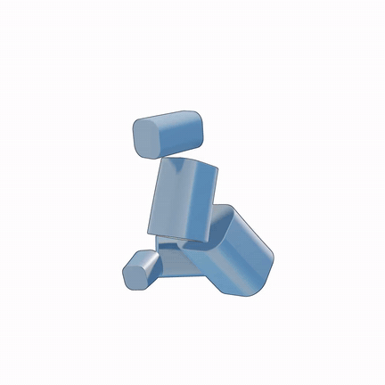

# SuperFit: Residual Primitive Fitting with SuperFrusta

<p align="center">
  <a href="https://arxiv.org/abs/2512.09201">
    
  </a>
  <a href="https://bardofcodes.github.io/superfit">
    
  </a>
  
  
</p>

<p align="center">
  <b>🏆 CVPR 2026 Oral & Award Candidate Paper (Top 1.8%)</b>
</p>

<p align="center">
  
</p>

SuperFit fits compact assemblies of **SuperFrusta** and other primitives to 3D shapes, built on top of **[SySL](https://github.com/BardOfCodes/sysl)**.
See **[Install](#install-instructions)** below and **[BibTeX](#bibtex)**.

## News

- **May 2026:** Added an optional custom CUDA kernel for `VarAxisSF`. On the recorded B200 benchmark, it is up to **8.5x faster end-to-end** than the dynamic `torch.compile` path, and up to **38.8x faster** for forward-only evaluation. Use it with `--ablation 8`; see [notes/custom_vasf_cuda.md](notes/custom_vasf_cuda.md) for details.

## Install Instructions

SuperFit fitting (`superfit-mesh-to-pa`) requires **all four steps below**, not just `uv sync`. Skipping cubvh, kaolin, or the Python/CUDA notes below produces the common `ModuleNotFoundError` / build failures on fresh checkouts.

### Quick install (Linux, mesh or point-cloud fitting)

Run from the repo root after cloning:

```bash
git clone https://github.com/BardOfCodes/superfit.git
cd superfit

# 1) Python + locked deps (uses .python-version → uv-managed 3.11.11)
uv python install 3.11.11
uv sync --extra recon          # recon = open3d + scikit-image for PLY → mesh
uv pip install ninja           # speeds up CUDA extension builds

# 2) cubvh (required; not on PyPI). Point nvcc at CUDA 12.x matching PyTorch.
#    Default /usr/local/cuda is often 11.8 and will fail against torch cu126.
export CUDA_HOME=/usr/local/cuda-12.4   # adjust if your CUDA 12.x path differs
export PATH="$CUDA_HOME/bin:$PATH"
export CC=gcc CXX=g++
uv pip install "cubvh @ git+https://github.com/ashawkey/cubvh" --no-build-isolation

# 3) kaolin (required for FlexiCubes mesh extraction; no PyPI wheel for torch 2.12)
git clone --recursive https://github.com/NVIDIAGameWorks/kaolin.git /tmp/kaolin
cd /tmp/kaolin
uv pip install -r tools/build_requirements.txt -r tools/viz_requirements.txt -r tools/requirements.txt
export IGNORE_TORCH_VER=1 CUDA_HOME=/usr/local/cuda-12.4
../superfit/.venv/bin/python setup.py install   # run from kaolin dir, not repo root
cd -

# 4) Smoke test
uv run python -c "import cubvh, kaolin, superfit; print('install ok')"
```

Use `uv run ...` for all scripts (no manual `activate` needed). For point clouds, reconstruct a watertight mesh first with `superfit-pointcloud-to-mesh` (needs `--extra recon` above), then run `superfit-mesh-to-pa`.

### 1. Create the environment with uv

[uv](https://docs.astral.sh/uv/) installs SuperFit into a local `.venv`, resolves locked dependencies from `uv.lock`, and installs the package in editable mode.

```bash
uv python install 3.11.11   # once per machine; .python-version pins this for uv sync
uv sync --extra recon       # include recon if you use PLY point clouds
```

> **Build note:** `geolipi` depends on `scikit-fmm`, which has no Linux wheel on Linux and must be compiled. Use uv-managed Python 3.11 (`uv python install 3.11.11`) rather than a system Python missing dev headers (e.g. `/usr/bin/python3.11` without `python3.11-dev`). Install `ninja` (`uv pip install ninja` or `apt install ninja-build`).

Other optional dependency sets:

```bash
uv sync --extra eval        # FAISS GPU for evaluation
uv sync --extra semantic    # semantic segmentation extras
uv sync --extra render      # rendering / visualization extras
uv sync --group dev         # pytest and ruff
```

Activate the virtual environment if you prefer an explicit shell:

```bash
source .venv/bin/activate
```

Otherwise run commands with `uv run ...` from the repo root; that uses the project `.venv` automatically (no `python` on your PATH required).

### 2. Install cubvh

[cubvh](https://github.com/ashawkey/cubvh) provides GPU-accelerated BVH queries and is **required** by the fitting pipeline. It is not on PyPI; install it into the project environment after `uv sync`:

```bash
export CUDA_HOME=/usr/local/cuda-12.4   # must be CUDA 12.x; see torch.version.cuda below
export PATH="$CUDA_HOME/bin:$PATH"
export CC=gcc CXX=g++
uv pip install ninja
uv pip install "cubvh @ git+https://github.com/ashawkey/cubvh" --no-build-isolation
```

This compiles a CUDA extension against your installed PyTorch. Check versions with:

```bash
uv run python -c "import torch; print('torch cuda', torch.version.cuda)"
nvcc --version
```

If `nvcc` reports 11.x but PyTorch reports 12.x, set `CUDA_HOME` to a CUDA 12 toolkit before building cubvh.

### 3. Install kaolin

[Kaolin](https://github.com/NVIDIAGameWorks/kaolin) is used for FlexiCubes meshing and is **required** for `superfit-mesh-to-pa`. See the [kaolin installation docs](https://kaolin.readthedocs.io/en/latest/notes/installation.html) for full details.

```bash
git clone --recursive https://github.com/NVIDIAGameWorks/kaolin.git
cd kaolin
uv pip install -r tools/build_requirements.txt -r tools/viz_requirements.txt -r tools/requirements.txt
export IGNORE_TORCH_VER=1
export CUDA_HOME=/usr/local/cuda-12.4
../superfit/.venv/bin/python setup.py install   # must run from kaolin/, not superfit/
cd ..
```

> **Note:** `IGNORE_TORCH_VER=1` is needed because kaolin's version check may not yet list the PyTorch version pinned in this repo.

### 4. Path Configuration

Before running any scripts, create a local path configuration:

```bash
cp superfit_config.example.json superfit_config.json
```

Edit `superfit_config.json` for your machine:

```json
{
  "data_base": "/path/to/your/data",
  "project_base": "/path/to/your/projects/project_sf",
  "outputs_base": "/path/to/your/outputs"
}
```

`superfit_config.json` is ignored by git. You can also point to another config
file with `SUPERFIT_CONFIG=/path/to/superfit_config.json`. All dataset and
artifact locations are derived from these values. See
[notes/dataset.md](notes/dataset.md) for details on expected data layout.

## What can you do with this repository?

### 1. Convert (watertight) meshes into Primitive Assemblies

```bash
uv run superfit-mesh-to-pa --input_path <path> --fastmode --save_mesh
```

Outputs go to `outputs/<date>-<time>/` by default (e.g. `outputs/2026-06-30-12-43-05/`). Pass `--save_dir` to override.

This will convert a watertight input mesh into a compact assembly of SuperFrusta. Use different `--ablation` options to generate assemblies of cuboids/superquadrics/supergeons etc. Use `--ablation 8` to enable the custom CUDA `VarAxisSF` path after building the extension. Note that `--fastmode` saves torch compile artifacts at `AOT_ARTIFACT_DIR` as specified in `superfit/utils/constants.py`.

<p align="center">
  
</p>

If the input mesh contains textures, you can run `fit_texture.py` to add textures to the primitive assembly. This will add 2D spherical textures to each primitive. We also have `testset_fit_textures.py` for running this process across multiple inputs.

```bash
uv run python scripts/fit_texture.py --input_path <path-to-assembly-pkl> --save_html --save_edit_html
```

<p align="center">
  
</p>


Finally, you can render short videos from any saved `primitive_assembly.pkl`. For
a compact demo, render the optimization replay, an exploded/colorized assembly,
and a final spiral view, then concatenate them:

```bash
uv run python scripts/visualize/generate_opt_video.py \
  --input_pkl <path-to-assembly-pkl> --mode opt_seq --save_dir <save-dir>

uv run python scripts/visualize/generate_opt_video.py \
  --input_pkl <path-to-assembly-pkl> --mode explode_color_compact --save_dir <save-dir>

uv run python scripts/visualize/generate_opt_video.py \
  --input_pkl <path-to-assembly-pkl> --mode spiral --save_dir <save-dir>

uv run python scripts/visualize/generate_opt_video.py \
  --input_pkl <path-to-assembly-pkl> --mode combine --save_dir <save-dir> \
  --combine_segments opt_seq explode_color_compact spiral
```

<p align="center">
  
</p>

Additional modes include `color_reveal`, `explode_spiral`,
`explode_pause_fit_back`, and `legacy_opt`.


Note that we don't generate html shaders for SuperQuadric since we don't have analytical sphere-traceable SDF functions for them. Additionally, please change the configuration in `superfit/utils/config.py` and `superfit/visualize/config.py` (camera/video defaults) if needed.

### 2. Evaluation on TestSet

We also release pre-computed primitive assemblies on Hugging Face:

<p align="center">
  <a href="https://huggingface.co/datasets/bardofcodes/superfit-primitive-assemblies">
    
  </a>
</p>

The dataset contains SuperFit outputs for Toys4K and PartObjaverse, including
`primitive_assembly.pkl`, fit configs, manifests, and evaluation summaries. The
release is useful if you want to inspect, render, or evaluate existing
assemblies without running the fitting pipeline yourself. See
[notes/dataset.md](notes/dataset.md#4-released-primitive-assemblies) for the
layout and licensing notes.

> **Known issue:** `primitive_assembly.pkl` artifacts are Python pickle files.
> Only load PKL files from trusted sources, because loading a pickle can execute
> arbitrary code.

1. Fit primitives to Toys4K

```bash
uv run superfit-fit-testset --start_ind 0 --end_ind 500 --fastmode --save_dir <save-path>
```

This will generate primitive assemblies for our Toys4K evaluation subset. You can additionally use `--dataset partobjaverse` to generate fits for the PartObjaverse dataset. To run Toys4K fitting in parallel across GPUs, launch the release script from the repository root:

```bash
bash job_scripts/all_toys4k.sh
```

2. Run Evaluation

Once the primitives are generated, you can run: 

```bash
uv run superfit-eval-testset --input_path <save-path> --save_per_instance_metrics --start_ind 0 --end_ind 500 --include_semantic
```

For the semantic metrics, we require [faiss](https://github.com/facebookresearch/faiss) as well as [PartField](https://github.com/nv-tlabs/PartField). Add `--include_semantic` to evaluate the semantic metrics.

### 3. Explore Fitting Results & Generate Detailed Meshes

| Assembly Visualizer | Primitive-guided Generation |
| --- | --- |
| <p align="center"></p> | <p align="center"></p> |


We also provide a complementary web app to explore the primitive assemblies - the fitting process, the metrics, the generated shapes etc. 


The inferred primitive assembly can also be used as spatial guidance to generate higher fidelity meshes by combining our method with [SpaceControl](https://spacecontrol3d.github.io), by E. Fedele et al.


Find instructions to install and run this at [superfit_app](https://github.com/BardOfCodes/superfit_app).

## Additional Details

Details regarding the dataset are provided in [notes/dataset.md](notes/dataset.md). For details regarding the primitives check out [notes/primitives.md](notes/primitives.md). We also made quite a few improvements over the results after our CVPR submission. These are listed in [notes/post_submission.md](notes/post_submission.md).

The [`notebooks/`](notebooks/) folder contains a few IPython notebooks which demo different aspects of our method such as (a) primitive design exploration in [notebooks/primitive_designs.ipynb](notebooks/primitive_designs.ipynb), (b) curvature exploration in [notebooks/mesh_curvature.ipynb](notebooks/mesh_curvature.ipynb), and (c) morphological decomposition in [notebooks/msd.ipynb](notebooks/msd.ipynb). 


## BibTeX

```bibtex
@misc{ganeshan2026superfit,
  title         = {Residual Primitive Fitting of 3D Shapes with SuperFrusta},
  author        = {Aditya Ganeshan and Matheus Gadelha and Thibault Groueix and Zhiqin Chen and Siddhartha Chaudhuri and Vladimir G. Kim and Wang Yifan and Daniel Ritchie},
  year          = {2026},
  booktitle     = {Proceedings of the IEEE/CVF Conference on Computer Vision and Pattern Recognition (CVPR)},
  month         = {June},
}
```

## Acknowledgements

This project was developed during an internship at Adobe Research. I (Aditya) am grateful to all co-authors for their invaluable contributions: [Matheus Gadelha](https://mgadelha.me/), [Thibault Groueix](https://www.tgroueix.com/), [Zhiqin Chen](https://czq142857.github.io/), [Siddhartha Chaudhuri](https://www.cse.iitb.ac.in/~sidch/), [Vladimir G. Kim](http://www.vovakim.com/), [Wang Yifan](https://yifita.github.io/), and [Daniel Ritchie](https://dritchie.github.io/).

Our sphere-tracing primitives and shaders draw heavily on foundational work by Inigo Quilez, and the broader [ShaderToy](https://www.shadertoy.com/) community — with special thanks to Paniq for creating the `superprimitive` and `uberprimitive` functions. 

Finally, Anton Mikhailov, Daichi Ito, and Luc Chamerlat from Adobe provided valuable feedback around primitive design and artist needs.

For questions reach out at `adityaganeshan@gmail.com`.
