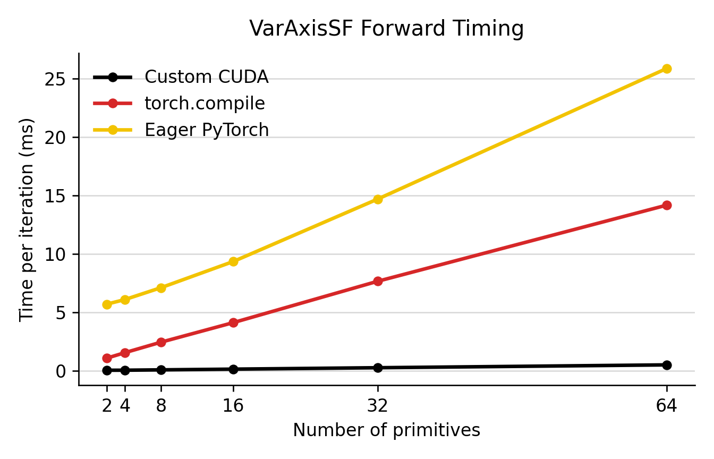
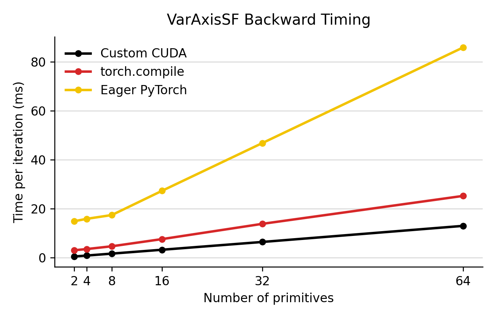
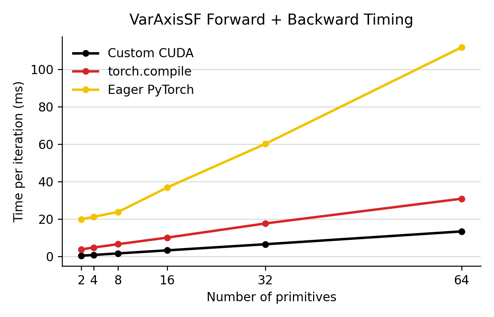

# CustomVASF CUDA Note

`CustomVASF` is an optional CUDA implementation for the VarAxisSF fast optimization path. It targets the hot call in `fast_opt.py`: evaluate all stochastic VarAxisSF primitives over a shared point cloud and assemble them with smooth union.

The custom path fuses primitive evaluation, outer stochastic keep/drop, and smooth-union assembly. It avoids materializing expanded coordinates when `coords` is `(1, M, 3)` and `params` is `(K, 17)`.

## How To Use

Build the optional extension once in the active environment:

```bash
python -m superfit.custom_ops.build
```

Then use ablation `8` for fitting:

```bash
python scripts/mesh_to_assembly.py \
  --input_path <path> --save_dir <save-dir> \
  --fastmode --ablation 8 --save_html --save_edit_html --save_mesh
```

For test-set runs, pass the same ablation:

```bash
python scripts/testset_fit_primitives.py \
  --dataset <dataset-name> --save_dir <save-dir> \
  --fastmode --ablation 8
```

`--ablation 8` selects `VarAxisSF` and sets `AlgorithmConfig.USE_CUSTOM_OP = True`. If the extension is not built, SuperFit raises an error with the build command. Use another ablation or set `USE_CUSTOM_OP = False` to return to the PyTorch path.

## Speedups

The largest forward win is avoiding the PyTorch graph overhead around many small tensor ops. A single CUDA path evaluates all primitives over the shared point cloud, applies the keep/drop logits, and performs the smooth-union scan without building intermediate Python/PyTorch tensors.

The largest backward win is the params-only VJP. The optimizer does not need coordinate gradients, so the custom path computes only parameter, smooth-union, and outer-logit gradients. For parameter gradients, the default path now uses a tiled partial-gradient reduction for `K >= 2`; this avoids heavy global atomic accumulation and was faster for every tested multi-primitive case on B200 at `200_000` points.

Smooth-union adjoints are also specialized. For `K <= 64`, the backward prep kernels cache prefix values instead of recomputing the full prefix chain for each primitive during the reverse pass.

On the recorded B200 benchmark with `200_000` points, CustomVASF is up to `8.5x` faster than dynamic `torch.compile` for the measured forward+backward path, and up to `38.8x` faster for forward-only evaluation.

Generate scaling plots:

```bash
python scripts/benchmark_custom_vasf_scaling.py
```

Defaults: `200_000` points, primitive counts `2,4,8,16,32,64`, and `100` timed iterations after warmup.

The CustomVASF params-backward path switches from a direct gradient kernel to a
tiled partial-gradient reduction when `K >= 2` by default. On B200 with
`200_000` points, the reduced path was faster for every tested `K >= 2`.
To test another cutoff without editing source, rebuild the extension after this
code is present and set `SUPERFIT_CUSTOM_VASF_REDUCED_BACKWARD_MIN_K`, or use
the benchmark helper:

```bash
python scripts/benchmark_custom_vasf_scaling.py --custom-threshold 2
python scripts/benchmark_custom_vasf_scaling.py --threshold-sweep 1,2,4,8
```

Outputs:

- `assets/custom_vasf_scaling.csv`
- `assets/custom_vasf_threshold_sweep.csv` when `--threshold-sweep` is used
- `assets/custom_vasf_forward.png`
- `assets/custom_vasf_backward.png`
- `assets/custom_vasf_together.png`

The compiled baseline uses `torch.compile(..., dynamic=True)` with the same dynamic batch/point axes as the optimizer path. Forward, backward, and combined timings are measured separately with fixed upstream gradients.

The plots compare eager PyTorch, dynamic `torch.compile`, and the CustomVASF CUDA kernel.

| Forward | Backward | Forward + Backward |
| --- | --- | --- |
|  |  |  |
